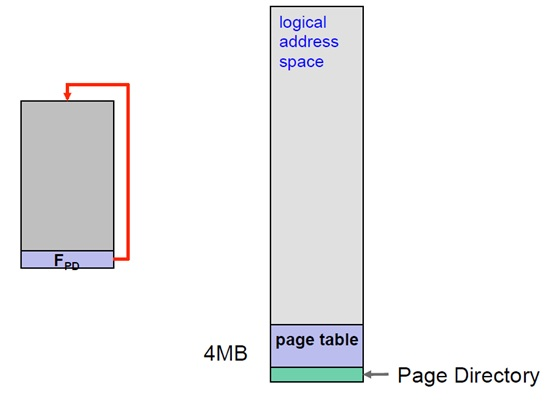
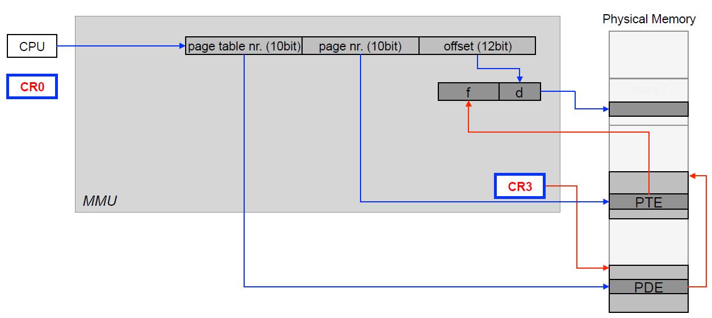

# Paging
## Physical Address Layout

## Logical Address Lookup

## Structure
### Address

### Page Directory

The Page Directory is the size of a frame. Each index references a different Page Table frame. This is located at the end of the logical address to allow for recursive lookup.

### Page Table

The Page Table is the size of a frame. Each index references a different data frame. This is located above the page directory to allow recursive lookup.
